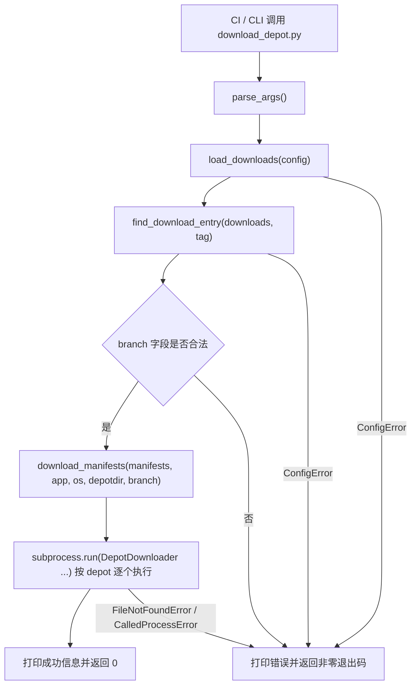

# download_depot

## Overview
`download_depot.py` 是一个小型 CLI 辅助脚本：读取 `download.yaml`，按精确 `tag` 匹配唯一下载项，并对该项声明的每个 depot manifest 逐个调用 `DepotDownloader`。它承担 CI 工作流与 depot 下载工具之间的配置解析、目标选择和错误归一化职责。

## Responsibilities
- 解析 CLI 参数，提供 `config`、`depotdir`、`app`、`os` 的默认值。
- 读取并校验 YAML 配置文件，确保根节点是 mapping，且 `downloads` 是由 mapping 组成的列表。
- 按精确 `tag` 选择唯一下载项，并校验其 `manifests` 与可选 `branch` 字段。
- 逐个 depot 构造并执行 `DepotDownloader` 命令，将配置错误、缺少可执行文件和子进程失败统一映射为非零退出码。

## Involved Files & Symbols
- `download_depot.py` - `ConfigError`
- `download_depot.py` - `parse_args`
- `download_depot.py` - `load_downloads`
- `download_depot.py` - `find_download_entry`
- `download_depot.py` - `download_manifests`
- `download_depot.py` - `main`
- `download.yaml` - `downloads[].tag` / `name` / `branch` / `manifests`
- `.github/workflows/build-on-self-runner.yml` - 调用 `uv run download_depot.py ...` 的下载步骤
- `tests/test_download_depot.py` - `TestDownloadDepot`

## Architecture
入口由 `main()` 串联：先调用 `parse_args()` 获取 CLI 参数，再用 `load_downloads()` 读取并校验 `download.yaml`，随后通过 `find_download_entry()` 对 `downloads[].tag` 做精确匹配并取得唯一目标项。`main()` 继续校验可选 `branch`，输出匹配结果和 manifest 数量，再将 `manifests/app/os/depotdir/branch` 传给 `download_manifests()`。

`download_manifests()` 不做网络层封装，而是直接遍历 `manifests` 映射，为每个 depot 组装一条 `DepotDownloader` 命令并调用 `subprocess.run(check=True)`；因此下载是串行执行的，任一 depot 失败都会立即终止后续下载并回到 `main()` 的异常处理分支。模块级顶部还额外处理了 `yaml` 依赖缺失场景：若导入失败，会直接打印提示并 `sys.exit(1)`，不会进入 `main()`。

## Dependencies
- `PyYAML`：通过 `yaml.safe_load()` 解析配置；若依赖缺失，模块导入阶段即提示执行 `uv sync` 并退出。
- `download.yaml`：配置唯一来源，要求根节点为 mapping，内部包含 `downloads` 列表，每项至少具备 `tag` 与 `manifests`。
- `DepotDownloader`：外部可执行文件，必须可从 `PATH` 找到。
- `.github/workflows/build-on-self-runner.yml`：当前已确认的调用侧，由工作流把 `TAG`、输出目录和配置路径传给该脚本。

## Notes
- `tag` 匹配是严格相等，不支持前缀、模糊或“最近版本”逻辑；未命中和重复命中都会直接失败。
- `manifests` 仅校验为 mapping；depot key 与 manifest value 在组装命令时统一走 `str()`，没有更细粒度的数值/格式校验。
- `branch` 为可选字段，但若存在必须是字符串；否则 `main()` 会抛出 `ConfigError`。
- 下载按 YAML 中 `manifests` 的迭代顺序串行执行，且 `check=True` 导致首个失败会中断整个批次。
- `ConfigError` 与缺少 `DepotDownloader` 的场景统一返回 `1`；子进程失败则尽量透传 `DepotDownloader` 的退出码。

## Callers (optional)
- `.github/workflows/build-on-self-runner.yml` 中的 depot 下载步骤会执行 `uv run download_depot.py -tag "$env:TAG" -depotdir "$depotDir" -config download.yaml`。
- `tests/test_download_depot.py` 中的 `TestDownloadDepot` 覆盖了精确匹配、缺失/重复 tag、branch 透传以及 `DepotDownloader` 缺失时的失败路径。