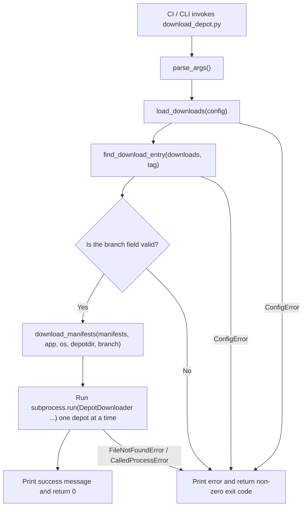

# download_depot

## Overview
`download_depot.py` is a small CLI helper script. It reads `download.yaml`, finds a unique download entry by exact `tag` match, and invokes `DepotDownloader` once for each depot manifest declared in that entry. It is responsible for configuration parsing, target selection, and error normalization between the CI workflow and the depot download tool.

## Responsibilities
- Parse CLI arguments and provide defaults for `config`, `depotdir`, `app`, and `os`.
- Read and validate the YAML configuration file, ensuring that the root node is a mapping and `downloads` is a list of mappings.
- Select a unique download entry by exact `tag`, and validate its `manifests` and optional `branch` fields.
- Build and execute a `DepotDownloader` command for each depot, mapping configuration errors, missing executables, and subprocess failures to non-zero exit codes.

## Involved Files & Symbols
- `download_depot.py` - `ConfigError`
- `download_depot.py` - `parse_args`
- `download_depot.py` - `load_downloads`
- `download_depot.py` - `find_download_entry`
- `download_depot.py` - `download_manifests`
- `download_depot.py` - `main`
- `download.yaml` - `downloads[].tag` / `name` / `branch` / `manifests`
- `.github/workflows/build-on-self-runner.yml` - download step that invokes `uv run download_depot.py ...`
- `tests/test_download_depot.py` - `TestDownloadDepot`

## Architecture
The entry flow is orchestrated by `main()`: it first calls `parse_args()` to obtain CLI parameters, then uses `load_downloads()` to read and validate `download.yaml`, and finally uses `find_download_entry()` to perform an exact match on `downloads[].tag` and obtain a unique target entry. `main()` then validates the optional `branch`, prints the match result and manifest count, and passes `manifests/app/os/depotdir/branch` to `download_manifests()`.

`download_manifests()` does not wrap the network layer. Instead, it directly iterates the `manifests` mapping, builds one `DepotDownloader` command per depot, and calls `subprocess.run(check=True)`; downloads therefore run serially, and any single depot failure immediately stops the remaining downloads and returns to the exception-handling branch in `main()`. The module top level also handles the missing-`yaml` dependency case: if the import fails, it prints a hint and exits with `sys.exit(1)` without entering `main()`.

## Dependencies
- `PyYAML`: used via `yaml.safe_load()` to parse the configuration; if the dependency is missing, the module import stage prints a `uv sync` hint and exits.
- `download.yaml`: the only configuration source; the root must be a mapping and must contain a `downloads` list where each entry has at least `tag` and `manifests`.
- `DepotDownloader`: external executable that must be discoverable via `PATH`.
- `.github/workflows/build-on-self-runner.yml`: currently confirmed caller, passing `TAG`, output directory, and configuration path to this script.

## Notes
- `tag` matching is strict equality only. Prefix matching, fuzzy matching, or "latest version" logic is not supported; both no-match and duplicate-match cases fail immediately.
- `manifests` is only validated as a mapping; depot keys and manifest values are both passed through `str()` when building commands, without deeper numeric/format validation.
- `branch` is optional, but if present it must be a string; otherwise `main()` raises `ConfigError`.
- Downloads run serially in the iteration order of `manifests` in the YAML, and `check=True` means the first failure aborts the entire batch.
- `ConfigError` and missing-`DepotDownloader` cases both return `1`; subprocess failures try to propagate `DepotDownloader`'s exit code.

## Callers (optional)
- The depot download step in `.github/workflows/build-on-self-runner.yml` runs `uv run download_depot.py -tag "$env:TAG" -depotdir "$depotDir" -config download.yaml`.
- `TestDownloadDepot` in `tests/test_download_depot.py` covers exact matching, missing/duplicate tags, branch passthrough, and the failure path when `DepotDownloader` is missing.
