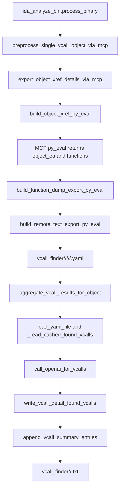

# ida_vcall_finder

## Overview
`ida_vcall_finder.py` provides two-stage support for the repository's `vcall_finder` workflow: it first uses MCP `py_eval` inside IDA to enumerate cross-referencing functions for a target object and export each function's disassembly/pseudocode to detail YAML files; it then runs OpenAI aggregation over those detail files to extract virtual-call sites and produce an object-level summary output.

## Responsibilities
- Build and normalize `vcall_finder` output paths, including detail YAML paths and object-level summary file paths.
- Generate remote `py_eval` scripts to query object xref functions inside IDA and export function disassembly plus Hex-Rays pseudocode.
- Parse and validate the JSON/ack payload returned by MCP `py_eval`, and report `success/failed/skipped` statistics.
- Assemble LLM prompts, call `OpenAI.chat.completions.create`, normalize `found_vcall`, write cached results back into detail YAML, and append them to the summary.

## Involved Files & Symbols
- `ida_vcall_finder.py` - `export_object_xref_details_via_mcp`
- `ida_vcall_finder.py` - `build_object_xref_py_eval`
- `ida_vcall_finder.py` - `build_function_dump_export_py_eval`
- `ida_vcall_finder.py` - `aggregate_vcall_results_for_object`
- `ida_vcall_finder.py` - `parse_llm_vcall_response`
- `ida_vcall_finder.py` - `_parse_py_eval_json_payload`
- `ida_analyze_bin.py` - `preprocess_single_vcall_object_via_mcp`
- `ida_analyze_bin.py` - `process_binary`
- `tests/test_ida_vcall_finder.py` - `TestBuildFunctionDumpExportPyEval`
- `tests/test_ida_vcall_finder.py` - `TestExportObjectXrefDetailsViaMcp`

## Architecture
The module revolves around a two-stage flow of "remote detail export -> local LLM summary aggregation":

Key implementation points:
- The detail file path format is `vcall_finder/<gamever>/<object>/<module>/<platform>/<func>.yaml`, and the summary path format is `vcall_finder/<gamever>/<object>.txt`.
- `build_object_xref_py_eval` uses `XrefsTo(object_ea)` inside IDA to find functions that reference the target object, then sorts and deduplicates them by function start address.
- `build_function_dump_export_py_eval` generates the remote export script and writes the fields `object_name/module/platform/func_name/func_va/disasm_code/procedure`; `procedure` depends on Hex-Rays and may be empty.
- `aggregate_vcall_results_for_object` clears the summary file first on each run, then iterates over detail YAML files; if a detail file already contains `found_vcall`, it reuses the cached result directly to avoid duplicate LLM requests.
- The summary is appended through `append_vcall_summary_entries` with `yaml.dump(..., explicit_start=True)`, so the `.txt` file actually stores a multi-document YAML stream.

## Dependencies
- `openai.OpenAI` - calls Chat Completions to extract `found_vcall`
- `PyYAML` - reads and writes detail YAML files plus the summary document stream
- `ida_analyze_util.build_remote_text_export_py_eval` - wraps remote text export scripts
- `ida_analyze_util.parse_mcp_result` - parses the return value from MCP `py_eval`
- IDA Python API - `ida_funcs`, `ida_name`, `idaapi`, `idautils`, `ida_lines`, `ida_segment`, `idc`
- Optional `ida_hexrays` - used when exporting pseudocode; degrades to an empty string if unavailable

## Notes
- This module is not a standalone CLI; it is currently invoked by `ida_analyze_bin.py` via import.
- `_normalize_safe_path_component` replaces `::`, path separators, reserved device names, and illegal characters to avoid cross-platform path issues.
- `export_object_xref_details_via_mcp` returns `skipped` for "object not found" or "no xref functions"; it returns `failed` for invalid payloads, ack validation failures, missing fields in function items, and similar issues.
- If a detail YAML file already exists, `export_object_xref_details_via_mcp` skips that function instead of re-exporting it.
- LLM aggregation has a hard dependency on `api_key` when a new client must be created; if no client is passed in and `api_key` is empty, `create_openai_client` raises immediately.
- `parse_llm_vcall_response` supports both fenced YAML code blocks and plain YAML text; any item missing `insn_va/insn_disasm/vfunc_offset` is discarded in `normalize_found_vcalls`.

## Callers
- `ida_analyze_bin.py` - `process_binary` calls `preprocess_single_vcall_object_via_mcp` for each `vcall_target`
- `ida_analyze_bin.py` - `preprocess_single_vcall_object_via_mcp` calls `export_object_xref_details_via_mcp`
- `ida_analyze_bin.py` - `main` calls `aggregate_vcall_results_for_object` after the export stage finishes
