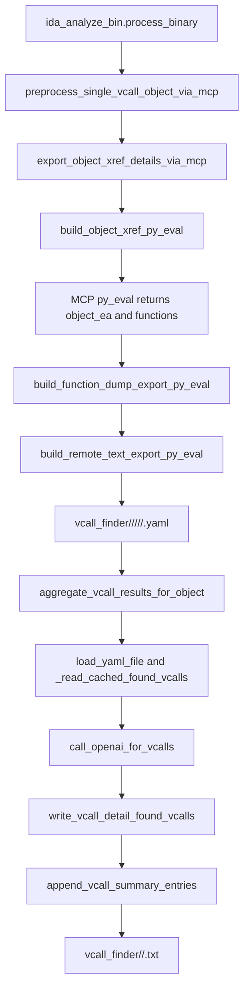

# ida_vcall_finder

## Overview
`ida_vcall_finder.py` 为仓库中的 `vcall_finder` 流程提供两段式支持：先通过 MCP `py_eval` 在 IDA 中枚举目标对象的交叉引用函数，并把每个函数的反汇编/伪代码导出为 detail YAML；再对这些 detail 文件执行 OpenAI 聚合，提取虚函数调用点并汇总为对象级 summary 输出。

## Responsibilities
- 构造并规范化 `vcall_finder` 输出路径，包括 detail YAML 与对象级 summary 文件路径。
- 生成远程 `py_eval` 脚本，在 IDA 中查询对象 xref 函数，并导出函数反汇编与 Hex-Rays 伪代码。
- 解析和校验 MCP `py_eval` 返回的 JSON/ack 载荷，并统计 `success/failed/skipped`。
- 组织 LLM prompt、调用 `OpenAI.chat.completions.create`、规范化 `found_vcall`、回填缓存到 detail YAML，并把结果追加到 summary。

## Involved Files & Symbols
- `ida_vcall_finder.py` - `export_object_xref_details_via_mcp`
- `ida_vcall_finder.py` - `build_object_xref_py_eval`
- `ida_vcall_finder.py` - `build_function_dump_export_py_eval`
- `ida_vcall_finder.py` - `aggregate_vcall_results_for_object`
- `ida_vcall_finder.py` - `parse_llm_vcall_response`
- `ida_vcall_finder.py` - `_parse_py_eval_json_payload`
- `ida_analyze_bin.py` - `preprocess_single_vcall_object_via_mcp`
- `ida_analyze_bin.py` - `process_binary`
- `tests/test_ida_vcall_finder.py` - `TestBuildFunctionDumpExportPyEval`
- `tests/test_ida_vcall_finder.py` - `TestExportObjectXrefDetailsViaMcp`

## Architecture
模块围绕“远程导出 detail -> 本地 LLM 聚合 summary”的双阶段流转：

关键实现点：
- detail 文件路径格式为 `vcall_finder/<gamever>/<object>/<module>/<platform>/<func>.yaml`，summary 路径格式为 `vcall_finder/<gamever>/<object>.txt`。
- `build_object_xref_py_eval` 在 IDA 中通过 `XrefsTo(object_ea)` 找到引用目标对象的函数，并按函数起始地址排序去重。
- `build_function_dump_export_py_eval` 生成远程导出脚本，写入字段 `object_name/module/platform/func_name/func_va/disasm_code/procedure`；其中 `procedure` 依赖 Hex-Rays，可为空。
- `aggregate_vcall_results_for_object` 每次先清空 summary 文件，再遍历 detail YAML；若 detail 已含 `found_vcall`，则直接复用缓存，避免重复 LLM 请求。
- summary 通过 `append_vcall_summary_entries` 以 `yaml.dump(..., explicit_start=True)` 追加，因此 `.txt` 文件实际承载的是多文档 YAML 流。

## Dependencies
- `openai.OpenAI` - 调用 Chat Completions 提取 `found_vcall`
- `PyYAML` - 读写 detail YAML 与 summary 文档流
- `ida_analyze_util.build_remote_text_export_py_eval` - 封装远程文本导出脚本
- `ida_analyze_util.parse_mcp_result` - 解析 MCP `py_eval` 返回值
- IDA Python API - `ida_funcs`、`ida_name`、`idaapi`、`idautils`、`ida_lines`、`ida_segment`、`idc`
- 可选 `ida_hexrays` - 导出伪代码时使用，缺失时降级为空字符串

## Notes
- 该模块不是独立 CLI，当前由 `ida_analyze_bin.py` 以导入方式调用。
- `_normalize_safe_path_component` 会替换 `::`、路径分隔符、保留设备名与非法字符，避免跨平台路径问题。
- `export_object_xref_details_via_mcp` 对“对象不存在”或“没有 xref 函数”返回 `skipped`；对 payload 非法、ack 校验失败、函数项缺字段等返回 `failed`。
- 若 detail YAML 已存在，`export_object_xref_details_via_mcp` 会跳过该函数，不重新导出。
- LLM 聚合在需要新建 client 时强依赖 `api_key`；若未传入 client 且 `api_key` 为空，`create_openai_client` 会直接抛错。
- `parse_llm_vcall_response` 同时支持 fenced YAML code block 与纯 YAML 文本；任何缺失 `insn_va/insn_disasm/vfunc_offset` 的条目都会在 `normalize_found_vcalls` 中被丢弃。

## Callers
- `ida_analyze_bin.py` - `process_binary` 为每个 `vcall_target` 调用 `preprocess_single_vcall_object_via_mcp`
- `ida_analyze_bin.py` - `preprocess_single_vcall_object_via_mcp` 调用 `export_object_xref_details_via_mcp`
- `ida_analyze_bin.py` - `main` 在导出阶段结束后调用 `aggregate_vcall_results_for_object`
