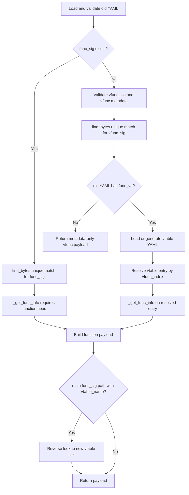

# preprocess_func_sig_via_mcp

## Overview
`preprocess_func_sig_via_mcp` is the main reuse entry for function-style YAML in `ida_analyze_util.py`. It prefers reusing an old `func_sig`; if the old YAML has no `func_sig`, it can fall back to `vfunc_sig + vtable metadata`, but the current implementation no longer auto-generates a new `func_sig` inside that fallback path.

## Responsibilities
- Validate prerequisites: PyYAML availability, old YAML existence and parseability, and the normalization result of `mangled_class_names`.
- Reuse the old `func_sig` through MCP `find_bytes` + `_get_func_info`, requiring a unique match and requiring the matched address to be a function head.
- When `func_sig` is missing, validate `vfunc_sig/vtable_name/vfunc_index/vfunc_offset` and resolve the target function via current-version vtable YAML.
- When vtable YAML is missing, generate it on demand via `preprocess_vtable_via_mcp` + `write_vtable_yaml`, and forward mangled symbol aliases when aliases exist.
- Produce standard function YAML data; if the main path already has `vtable_name`, reverse-look up the new vtable and fill `vfunc_offset/vfunc_index`.
- For metadata-only vfunc entries without an old `func_va`, preserve and write back only `vfunc_sig/vtable_name/vfunc_offset/vfunc_index`.

## Involved Files & Symbols
- `ida_analyze_util.py` - `preprocess_func_sig_via_mcp`
- `ida_analyze_util.py` - `preprocess_vtable_via_mcp`
- `ida_analyze_util.py` - `write_vtable_yaml`
- `ida_analyze_util.py` - `_normalize_mangled_class_names`
- `ida_analyze_util.py` - `_get_mangled_class_aliases`

## Architecture
1. Input validation
   - Return `None` immediately if PyYAML is unavailable, `old_path` does not exist, the old YAML cannot be parsed into a dict, or `mangled_class_names` normalization fails.
2. Main path: old `func_sig`
   - `find_bytes(limit=2)` must return a unique match.
   - `_get_func_info` requires the matched address to be the function head and returns `func_va/func_size`.
3. Fallback path: old YAML has no `func_sig`
   - `vfunc_sig` and `vtable_name` must exist, and at least one of `vfunc_index` / `vfunc_offset` must exist.
   - Normalize slot metadata using an 8-byte stride, and enforce `vfunc_offset == vfunc_index * 8`.
   - `find_bytes(limit=2)` must uniquely match `vfunc_sig`.
   - If the old YAML has no `func_va`, return a metadata-only result containing `func_name/vfunc_sig/vtable_name/vfunc_offset/vfunc_index` and stop without resolving the vtable.
   - Otherwise, read `{vtable_name}_vtable.{platform}.yaml` from `new_binary_dir`; if it is missing, generate it on demand, then locate the function address by `vfunc_index` and call `_get_func_info`.
4. Result assembly
   - Whenever a concrete function is resolved, return `func_name`.
   - Preserve the old `func_sig` on the main `func_sig` path.
   - Preserve `vfunc_sig/vtable_name/vfunc_offset/vfunc_index` on the vfunc fallback path.
5. Extra vtable alignment for the main path
   - If the main path already has `vtable_name`, reload or regenerate the new vtable YAML, reverse-look up the index of `func_va` in the new `vtable_entries`, and write back the new `vfunc_offset/vfunc_index`.

## Dependencies
- Internal: `parse_mcp_result`, `preprocess_vtable_via_mcp`, `write_vtable_yaml`, `_normalize_mangled_class_names`, `_get_mangled_class_aliases`
- MCP: `find_bytes`, `py_eval`
- Stdlib / third-party: `os`, `json`, `yaml`
- Resource dependency: old YAML, plus optional current-version `*_vtable.{platform}.yaml`

## Notes
- Path selection is still one-way: as long as the old YAML contains `func_sig`, the main path does not automatically fall back to `vfunc_sig` after failure.
- `_get_func_info` requires the matched address to be a function head; mid-function matches are rejected.
- Vtable slot computation is still hard-coded to an 8-byte stride.
- `_load_vtable_data` has side effects: when data is missing, it generates and writes vtable YAML on the spot.
- If the old YAML has no `func_va`, this function can still succeed, but the result contains only vfunc metadata and omits `func_va/func_rva/func_size`.
- The current implementation does not call `preprocess_gen_func_sig_via_mcp` inside the vfunc fallback path.

## Callers
- `preprocess_common_skill` in `ida_analyze_util.py` uses it as the primary entry for the normal function pipeline.
- `preprocess_common_skill` in `ida_analyze_util.py` also runs it as a fast path before inherited-vfunc fallback.
- `tests/test_ida_analyze_util.py` covers its direct behavior.
