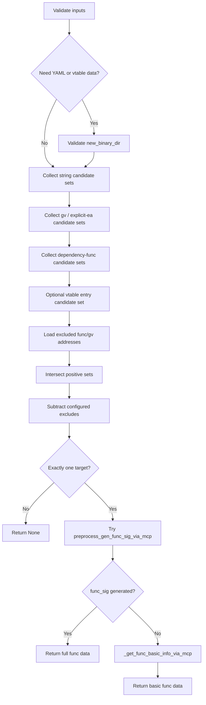

# preprocess_func_xrefs_via_mcp

## Overview
`preprocess_func_xrefs_via_mcp` is the unified xref-based function resolution entry in `ida_analyze_util.py`. It intersects candidate sets built from string references, xrefs that depend on function or global-variable addresses, and optional vtable-entry candidates, then subtracts excluded functions and finally attempts to generate a new `func_sig`.

## Responsibilities
- Validate `xref_strings/xref_gvs/xref_funcs/exclude_funcs/exclude_gvs` input, as well as the conditional `new_binary_dir` prerequisite required only for symbol-YAML / vtable-backed modes.
- Collect sets of function start addresses referenced by strings via `_collect_xref_func_starts_for_string`.
- Collect sets of referencing functions based on dependency addresses via `_collect_xref_func_starts_for_ea`; `xref_gvs` / `exclude_gvs` support both reading `gv_va` from current-version YAML and using explicit `0x...` addresses directly.
- When `vtable_class` is provided, use all `vtable_entries` from `{vtable_class}_vtable.{platform}.yaml` as an extra positive candidate set.
- Before uniqueness checks, read `func_va` for `exclude_funcs` from current-version YAML and subtract them from the candidate set.
- After locking onto a unique target, prefer `preprocess_gen_func_sig_via_mcp`, and fall back to `_get_func_basic_info_via_mcp` on failure.

## Involved Files & Symbols
- `ida_analyze_util.py` - `preprocess_func_xrefs_via_mcp`
- `ida_analyze_util.py` - `_load_gv_or_explicit_ea`
- `ida_analyze_util.py` - `_is_explicit_address_literal`
- `ida_analyze_util.py` - `_collect_xref_func_starts_for_string`
- `ida_analyze_util.py` - `_collect_xref_func_starts_for_ea`
- `ida_analyze_util.py` - `_get_func_basic_info_via_mcp`

## Architecture
1. Validate conditional prerequisites
   - `new_binary_dir` is required whenever `xref_funcs`, `exclude_funcs`, or `vtable_class` is used, or whenever `xref_gvs` / `exclude_gvs` contains symbol names rather than explicit address literals.
2. Build positive candidate sets
   - If `vtable_class` is provided, first read `{vtable_class}_vtable.{platform}.yaml` and use all `vtable_entries` addresses as one candidate set.
   - For each string in `xref_strings`, call `_collect_xref_func_starts_for_string`.
   - For each entry in `xref_gvs`, if it is `0x...`, parse it directly as an EA; otherwise read `gv_va` from `{symbol}.{platform}.yaml` and then call `_collect_xref_func_starts_for_ea`.
   - For each function name in `xref_funcs`, read `func_va` from `{func_name}.{platform}.yaml` and then call `_collect_xref_func_starts_for_ea`.
3. Build negative filter sets
   - For each function name in `exclude_funcs`, read current-version YAML and collect its `func_va`.
   - For each entry in `exclude_gvs`, if it is `0x...`, parse it directly as an EA; otherwise read `gv_va` from current-version YAML and collect the corresponding xref-function set.
4. Lock the target
   - Intersect all positive candidate sets.
   - Subtract function addresses hit by `exclude_funcs`, `exclude_strings`, and `exclude_gvs` from the intersection.
   - Exactly one function start address must remain at the end.
5. Produce YAML data
   - First try `preprocess_gen_func_sig_via_mcp`.
   - If `func_sig` is generated successfully, attach `func_name` and return directly.
   - If generation fails, fall back to `_get_func_basic_info_via_mcp` and return basic metadata plus `func_name`.

## Dependencies
- Internal: `_read_yaml_file`, `_parse_int_value`, `_is_explicit_address_literal`, `_load_gv_or_explicit_ea`, `_collect_xref_func_starts_for_string`, `_collect_xref_func_starts_for_ea`, `_get_func_basic_info_via_mcp`, `preprocess_gen_func_sig_via_mcp`
- MCP: `py_eval` (used indirectly via helpers), `find_bytes` (used inside `preprocess_gen_func_sig_via_mcp`)
- Resource dependency: current-version `*.{platform}.yaml` function artifacts, symbol-based gv artifacts, and optional `*_vtable.{platform}.yaml`

## Notes
- `_collect_xref_func_starts_for_string` currently uses substring matching (`search_str in str(s)`), not exact string equality.
- Pure string mode and pure explicit-`0x...` gv mode do not require `new_binary_dir`; only symbol-YAML / vtable-backed modes do.
- Explicit address literals are currently recognized by the `0x` prefix and parsed through `_parse_int_value`.
- Uniqueness is checked after exclusion filtering, so `exclude_funcs` / `exclude_gvs` can be used to disambiguate candidates that would otherwise tie.
- If signature generation fails, this function can still return `func_va/func_rva/func_size`, just without `func_sig`.

## Callers
- `preprocess_common_skill` in `ida_analyze_util.py` uses it as the unified func-xref fallback.
