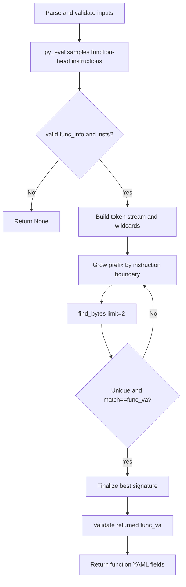

# preprocess_gen_func_sig_via_mcp

## Overview
`preprocess_gen_func_sig_via_mcp` is an async helper in `ida_analyze_util.py` that generates the shortest unique function-head signature from a known function entry address. It first samples the instruction stream inside IDA and marks variable bytes, then grows candidate signatures only on full-instruction boundaries, and finally returns fields that can be written directly into function YAML.

## Responsibilities
- Parse and validate `func_va`, length limits, and `extra_wildcard_offsets`.
- Sample the instruction stream from the function head via MCP `py_eval`.
- Mark operand bytes and control-flow relative displacement bytes as wildcards.
- Grow the signature prefix only on full-instruction boundaries and use MCP `find_bytes` for uniqueness checks.
- Enforce that the unique matched address must equal the target function entry address.
- Return `func_va/func_rva/func_size/func_sig` for the caller to write into YAML.

## Involved Files & Symbols
- `ida_analyze_util.py` - `preprocess_gen_func_sig_via_mcp`

## Architecture
1. Parameter normalization and validation
   - Parse `func_va` and the various length parameters.
   - Keep only non-negative `extra_wildcard_offsets`.
2. IDA-side sampling (`py_eval`)
   - First validate that `func_va` is a function head.
   - Sample from the function entry forward up to the `max_sig_bytes` / `max_instructions` limits.
   - Record the raw bytes and wildcard positions for each instruction.
3. Python-side shortest search
   - Flatten the sampled result into a token stream.
   - Overlay `extra_wildcard_offsets` on absolute offsets.
   - Test only prefixes ending on full-instruction boundaries.
   - Require `find_bytes(limit=2)` to return a unique match, and require the matched address to equal `func_va`.
4. Result assembly
   - Re-validate the returned `func_va`.
   - Return `func_va`, `func_rva`, `func_size`, and `func_sig`.

## Dependencies
- Internal: `parse_mcp_result`
- MCP: `py_eval`, `find_bytes`
- IDA Python API (inside `py_eval`): `idaapi`, `ida_bytes`, `idautils`, `ida_ua`
- Stdlib: `json`

## Notes
- `func_va` must be a function entry; mid-function addresses fail validation.
- The shortest-search scope is constrained by sampled byte and instruction limits; limits that are too small can cause generation to fail.
- `extra_wildcard_offsets` are absolute offsets relative to the function start; overusing wildcards can destroy uniqueness.
- Even if a signature is unique, it is still rejected when the matched address is not the target function head.
- This function itself does not write files; persistence is handled by the caller.

## Callers
- `preprocess_index_based_vfunc_via_mcp` in `ida_analyze_util.py` calls it when the inherited-vfunc fallback resolves a slot but no reusable old `func_sig` exists.
- `preprocess_func_xrefs_via_mcp` in `ida_analyze_util.py` calls it after xref resolution finds a unique target function.
