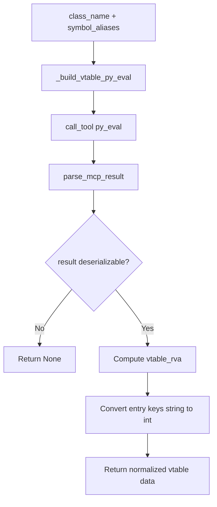

# preprocess_vtable_via_mcp

## Overview
`preprocess_vtable_via_mcp` is an async helper in `ida_analyze_util.py` that resolves a vtable by class name and supports optional explicit mangled symbol aliases. It does not depend on old YAML; instead, it runs a shared template script through MCP `py_eval` and normalizes the result into a structure that can be written into vtable YAML.

## Responsibilities
- Accept `class_name` and optional `symbol_aliases`, and construct the corresponding IDA query script.
- Invoke MCP `py_eval` and unwrap the outer result wrapper.
- Deserialize the JSON string returned by the template into structured vtable information.
- Compute `vtable_rva` from `image_base`.
- Convert the string keys in `vtable_entries` caused by JSON serialization back into integers.
- Return a normalized result that can be passed directly to `write_vtable_yaml`.

## Involved Files & Symbols
- `ida_analyze_util.py` - `preprocess_vtable_via_mcp`
- `ida_analyze_util.py` - `_build_vtable_py_eval`
- `ida_analyze_util.py` - `_VTABLE_PY_EVAL_TEMPLATE`

## Architecture
1. Build `py_eval` code
   - `_build_vtable_py_eval(class_name, symbol_aliases)` injects both `CLASS_NAME_PLACEHOLDER` and `CANDIDATE_SYMBOLS_PLACEHOLDER`.
2. Execute the MCP call
   - Run `session.call_tool(name="py_eval", arguments={"code": py_code})`.
   - Use `parse_mcp_result` to remove one layer of result wrapping.
3. Parse the template result
   - Expect a dict containing a `result` JSON string.
   - Deserialize it into `vtable_info`.
4. Normalize and return
   - Compute `vtable_rva = int(vtable_va, 16) - image_base`.
   - Convert `vtable_entries` keys from strings to `int`.
   - Return `vtable_class`, `vtable_symbol`, `vtable_va`, `vtable_rva`, `vtable_size`, `vtable_numvfunc`, and `vtable_entries`.

### Core strategy inside `_VTABLE_PY_EVAL_TEMPLATE`
- First try the explicitly provided `candidate_symbols`.
- If resolution still fails, try automatically derived direct symbols:
  - Windows: `??_7<Class>@@6B@`
  - Linux: `_ZTV<len><Class>`, with the start address adjusted by `+0x10`
- If direct-symbol lookup fails, fall back to RTTI:
  - Windows: `??_R4<Class>@@6B@` + `.rdata` references
  - Linux: `_ZTI<len><Class>` references + the offset-to-top rule
- Finally, parse vtable entries by pointer width and stop when non-code or boundary conditions are encountered.

## Dependencies
- Internal: `_build_vtable_py_eval`, `_VTABLE_PY_EVAL_TEMPLATE`, `parse_mcp_result`
- MCP: `py_eval`
- Stdlib: `json`
- IDA API (inside the template script): `ida_bytes`, `ida_name`, `idaapi`, `idautils`, `ida_segment`

## Notes
- The function body still ignores the `platform` parameter; platform differences are primarily handled by the symbol-selection logic inside the template.
- `image_base` must support integer subtraction, otherwise `vtable_rva` computation fails.
- Key result fields are accessed by direct indexing; if the template returns an unexpected structure, this can raise an exception rather than returning `None` cleanly.
- Conversion of `vtable_entries` keys depends on every key being parseable by `int()`.
- This helper only returns data and does not persist it; actual YAML writing is handled by the caller.

## Callers
- `preprocess_func_sig_via_mcp` in `ida_analyze_util.py` calls it on demand when the vtable YAML is missing.
- `preprocess_common_skill` in `ida_analyze_util.py` uses it for direct vtable targets.
- `preprocess_common_skill` in `ida_analyze_util.py` also calls it when filling `func_vtable_relations` metadata.
