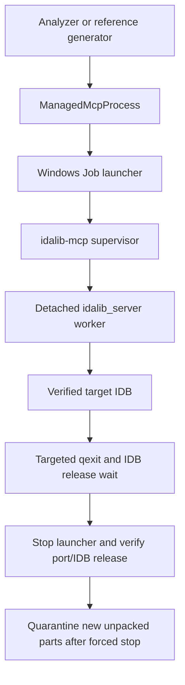

# idalib-mcp

## Agent session bootstrap (prefer MCP management tools)

An agent that needs an IDB must bind the session in this order before any IDE tool call:

1. `idb_list` — list attached sessions. If the target `.i64` (or its binary) is already open, reuse it and pass that `database` id to later calls.
2. `idb_open` — only when step 1 shows the target is not open. Pass the `.i64` path or the binary; default `idle_ttl_sec` is 600 s.
3. Repository `idalib-mcp` script fallback (`uv run ida_analyze_bin.py`, `uv run generate_reference_yaml.py ... -auto_start_mcp`) — only when the MCP endpoint (default `127.0.0.1:13337`) is unreachable.

Never call `open_file`: it switches the IDA GUI document and can move the session onto an unintended binary. The shared agent-facing copy of this rule is `.claude/skills/generate-signature-for-function/references/mcp-ida-session.md`; the agents are `.claude/agents/sig-finder.md` and `.opencode/agents/sig-finder.md`.

Session ownership matters: an agent fallback (`agent_runner.py`) is handed an *owned* endpoint whose worker the runner opened and saves. When `idb_list` already shows the assigned database attached, the agent reuses it and must **not** close it; only a session the agent opened itself via `idb_open` is closed by the agent.

## Hard save rule (idle TTL does NOT save)

A worker that exits on idle TTL (default 600 s, refreshed by each JSON-RPC call) does **not** save. Every IDB change the session made — renames, comments, `define_func`, type edits — is lost on that self-exit. Before finishing, call `idb_close` with `save=True`; if the session must stay open, call `idb_save`, then still `idb_close(save=True)` when the work is done. Never leave a mutated IDB to idle out. This is the same contract the repository honors in code: `warmup_idb_worker.py` runs `save_database(None, 0)` before `close_database()`, mirroring idalib-mcp's `idb_save`.

## Overview

`ida_analyze_bin.py` owns one `idalib-mcp` supervisor per binary. In ida-pro-mcp 2.0.0 the supervisor intentionally starts a detached `idalib_server` worker, so stopping the supervisor alone cannot release an open IDB. On Windows a repository launcher joins a kill-on-close Job before spawning the supervisor; its descendants share that Job.

## Responsibilities

- Start the owned MCP supervisor, bind and verify the exact target database, then run analysis.
- Request targeted `qexit` only for a verified owned worker. Wait up to 60 seconds for IDB handle release before stopping the launcher.
- On Windows, force-stop the per-binary Job when graceful quit fails. Verify the supervisor port and IDB handles are released; cleanup failure aborts the run even with `-skip_error`.
- Quarantine only unpacked IDB side files created by the current launch after forced cleanup. Preserve packed `.i64`/`.idb` and all pre-existing side files.

## Involved Files & Symbols

- `ida_analyze_bin.py` — `ManagedMcpProcess`, `start_idalib_mcp`, `quit_ida_gracefully`, `stop_idalib_mcp_process`, IDB side-file checks/quarantine.
- `ida_mcp_job_launcher.py` — per-launch Windows Job owner and analyzer-parent watcher.
- `windows_job.py` — shared ctypes Job API; `warmup_memory.py` uses it for warmup memory controls.
- `ida_mcp_session.py` — owned database selection and MCP session binding.
- `generate_reference_yaml.py` — reuses the same owned startup and cleanup path.
- `tests/test_ida_mcp_job_launcher.py` and `tests/test_ida_analyze_bin.py` — process-tree and cleanup regression tests.

## Architecture

```mermaid
flowchart TD
    A[Analyzer or reference generator] --> B[ManagedMcpProcess]
    B --> C[Windows Job launcher]
    C --> D[idalib-mcp supervisor]
    D --> E[Detached idalib_server worker]
    E --> F[Verified target IDB]
    F --> G[Targeted qexit and IDB release wait]
    G --> H[Stop launcher and verify port/IDB release]
    H --> I[Quarantine new unpacked parts after forced stop]
```

## Dependencies

- Installed `idalib-mcp` executable and IDA/idalib; `ida-pro-mcp 2.0.0` uses a supervisor plus detached worker.
- Windows Job Object API via the standard-library `ctypes`; no new Python dependency.
- `.id0` is an unpacked IDA database component, not a disposable lock marker. A pre-existing `.id0` blocks startup until its ownership and recovery are resolved.

## Notes

- Job ownership is scoped to one launcher/binary. Do not assign the analyzer process itself to this Job or kill an attached external IDA process.
- The launcher watches its analyzer parent. Parent exit closes the launcher's only Job handle, killing the owned tree.
- An exited launcher is not by itself cleanup proof: verify the supervisor port and exclusive access to `.id0` candidates before restart or IDB invalidation.
- Only a current-run forced exit may move new `.id0/.id1/.id2/.nam/.til` files into `.ida-aborted/<binary-name>/<run-id>/`. Pre-existing or ambiguous files remain untouched and cause an explicit error.
- The packed `.i64` survives forced cleanup; `-require_warm_idb` still rejects a genuinely missing warm database.
- Other platforms retain their existing subprocess launch behavior.

## Callers

- `ida_analyze_bin.process_binary` starts one owned MCP process for each pending module/platform binary.
- `generate_reference_yaml.autostart_mcp_session` uses the same startup and cleanup helpers for `-auto_start_mcp`.

## Source

This CS2-specific lifecycle note supersedes the earlier GoldSrc-derived description.
